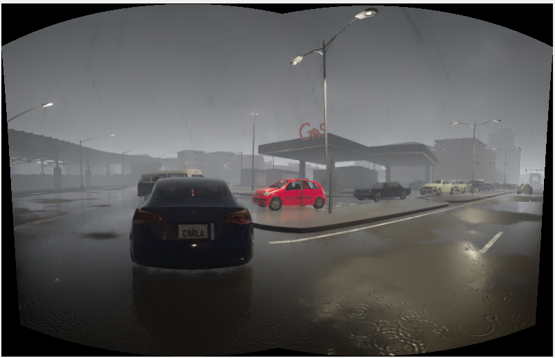

# Image Stitching with OpenCV

This project demonstrates how to stitch multiple images together using OpenCV and a simple Tkinter GUI. The application allows users to select at least three images and stitches them into a single panoramic image.

## Requirements

- Python 3.x
- OpenCV
- NumPy
- Tkinter
- Pillow

## Installation

1. Clone the repository:
    ```sh
    git clone https://github.com/yourusername/Image_Stitching.git
    ```
2. Navigate to the project directory:
    ```sh
    cd Image_Stitching
    ```
3. Install the required packages:
    ```sh
    pip install -r requirements.txt
    ```

## Usage

1. Run the main script:
    ```sh
    python main.py
    ```
2. Click on the "Open Images" button to select at least three images.
3. Click on the "Stitch Images" button to stitch the selected images together.
4. The stitched image will be displayed in the application window.

## Results


<!-- ### Input Images


 -->

## License

This project is licensed under the MIT License. See the [LICENSE](LICENSE) file for details.
